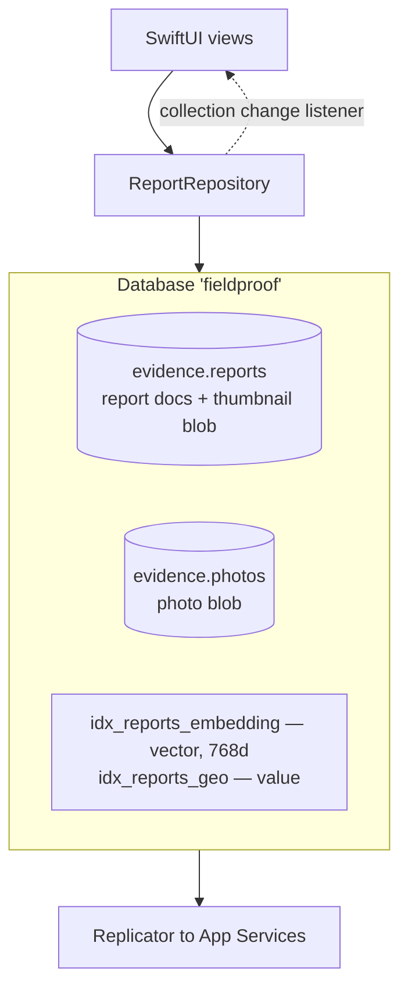

# Couchbase Lite on the phone

Couchbase Lite Swift **Enterprise Edition 4.1.2**, added with Swift Package Manager
(`couchbase-lite-swift-ee`, product `CouchbaseLiteSwift`), plus the **Vector Search extension 2.0.0**
(`couchbase-lite-vector-search-spm`). Those are the only two dependencies in the iOS app.

## Where it sits



## How FieldProof uses it

**Open, and mirror the server's names.** `DatabaseManager.open()` creates the database file and the two
collections in the `evidence` scope — the same scope and collection names the Capella cluster uses, so nothing
is renamed in transit.

```swift
let db = try Database(name: "fieldproof")
let reports = try db.createCollection(name: "reports", scope: "evidence")
_ = try db.createCollection(name: "photos", scope: "evidence")
```

**Indexes are created at startup, every launch.** Both calls are idempotent: a vector index over the 768-float
`embedding`, and an ordinary value index over `type`, `status` and the two location fields. The value index
serves the bounding-box and status filters in the same query that does the vector search.

**Documents are plain JSON.** `Report.init?(document:)` and `Report.document()` map the struct to and from a
`MutableDocument`. Empty fields are removed rather than stored as empties, so `attachedTo IS MISSING` is a
meaningful predicate. Timestamps are ISO-8601 UTC strings, which sort correctly as strings and read the same
in SQL++ on the phone and on the server.

**Blobs carry the pixels.** The report holds a small thumbnail blob; the photo document holds the full JPEG.
Couchbase Lite stores blob bytes outside the document body and replicates them as attachments, so a list view
that only reads metadata never pays for the photo.

**One batch per capture.** `ReportRepository.save()` wraps the report, the photo, and the parent's updated
`relatedReportIds` in `database.inBatch(using:)`. Either the whole capture lands or none of it does.

**The UI follows the database, not the network.** The list observes the collection:

```swift
tokens.append(reports.addChangeListener(queue: .main) { _ in reload() })
```

A collection change listener was the right tool here. A live query re-fires when documents enter or leave the
result set, but a status change that arrives from the dashboard only changes a field value on a document that
was already in the list — the collection listener sees it (`docs/REFERENCE.md` §7.4).

**Queries are SQL++, written as strings.** No builder API is used anywhere in the app, so what a presenter shows
on screen is the same language the dashboard uses against Capella. Two details worth knowing before you type:
`$limit` is reserved (FieldProof uses `$maxResults`), and `--` comments are rejected by the on-device parser
even though the server accepts them.

## Talking points

- "This is a real database on the phone, not a cache: collections, indexes, SQL++, and transactions."
- "The scope and collection names on the phone are the scope and collection names in Capella. One model, two places."
- "The save is a batch. Three documents change together or not at all — offline, in a canyon, on a dying battery."
- "The list is driven by a database change listener. The dashboard changes a status in Capella and the crew's
  list updates itself, with no polling code in the app."
- "Blobs mean the metadata can arrive on the supervisor's map seconds before the photograph does."

## Possible enhancements

- **Encryption at rest.** Enterprise Edition can encrypt the local database with a key supplied at open time; the
  key belongs in the Keychain. Check the current Swift API in the official docs before writing it — this repo has
  not verified it.
- **Peer-to-peer.** Couchbase Lite 4.1's multipeer replicator syncs directly between nearby devices over Wi-Fi
  and Bluetooth LE. For a crew working a valley with no coverage, that means findings spread across the team
  before anyone reaches signal.
- **Lazy vector index** for embeddings computed after the document is saved (useful if a model runs on a queue).
- **Predictive / prebuilt Core ML integration** if the classifier moves from Vision to a custom model.
- **`performMaintenance(type:)`** on a schedule for long-lived installs.

## Alternatives and trade-offs

| Option | Trade-off |
|---|---|
| **SQLite + hand-written sync** | You own conflict resolution, checkpoints, retries, partial failure, and per-user filtering. That code is where offline apps usually die. Couchbase Lite ships it. |
| **Realm / MongoDB Atlas Device Sync** | Atlas Device Sync was retired in September 2025; new work needs a different answer. |
| **PowerSync, Ditto, ObjectBox** | Real products with real offline stories. None of them put an ANN vector index next to the documents on the device and let you query both in one statement, which is this demo's centrepiece. |
| **Firebase Firestore offline mode** | Good local cache and listeners, but the offline window is a cache, the query language is limited, and there is no on-device vector index. |
| **Core Data / SwiftData** | Fine local storage, no sync to a server system of record, no SQL++, no vector search. |

A note on editions: the vector search extension and database encryption are **Enterprise Edition** features.
Community Edition gives you the database and replication, not the index that this demo is built around.

Related: [vector-search-on-device](vector-search-on-device.md) · [sync-and-app-services](sync-and-app-services.md)
