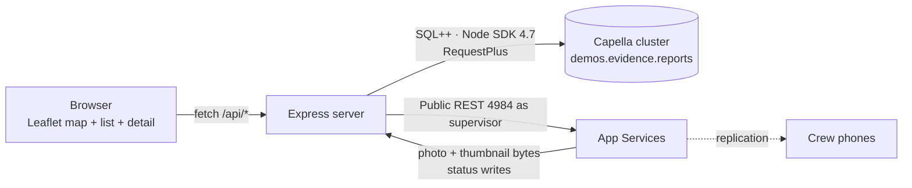

# The supervisor dashboard and Capella

About 520 lines of JavaScript: Express, Leaflet, no build step, no framework, no TypeScript. It exists to show
that the data a phone wrote offline is ordinary data in Capella the moment it arrives.



## How FieldProof uses it

**Two data paths, each doing what it is good at.**

*Reads that are questions* go to the cluster as SQL++ through the Node SDK. The map and list are one statement:

```sql
SELECT META().id AS id, district, status, category, createdAt, createdBy, notes,
       location.lat AS lat, location.lon AS lon,
       thumbnail.digest AS thumb,
       ARRAY_LENGTH(IFMISSINGORNULL(relatedReportIds, [])) AS attached
FROM `demos`.evidence.reports
WHERE type = "report"
  AND district IS NOT MISSING
  AND attachedTo IS MISSING
  AND ($district IS NULL OR district = $district)
  AND ($status IS NULL OR status = $status)
ORDER BY createdAt DESC
```

Note `attachedTo IS MISSING`: attached duplicate captures ride along with their parent rather than becoming
second pins on the map. The detail query uses `USE KEYS` and strips the 768-float embedding and the thumbnail
blob metadata out of the document with `OBJECT_REMOVE`, because neither belongs in a JSON response.

*Bytes and writes* go to App Services' Public REST API as the `supervisor` app user: the photo and thumbnail
attachments (`blob_%2Fphoto`, `blob_%2Fthumbnail`), and status changes. A status change written there is an
ordinary document update — it passes the same sync function and replicates down to the crew's phones within
seconds, which is the last beat of the demo.

**Query consistency is chosen, not accidental.** Every query runs with
`scanConsistency: QueryScanConsistency.RequestPlus`, so a report that synced from a phone a second ago is
already in the index when the dashboard asks. The alternative — the default, `NotBounded` — is faster and would
make the demo look broken.

**Indexes are created by a script, not by hand.** `scripts/setup-cluster.mjs` creates the scope, the two
collections and three indexes (`idx_reports_list` on `district, status, createdAt` where `type = "report"`,
`idx_photos_report`, and a primary index for ad-hoc work), and is safe to re-run.

**Connection.** One connection string, one database credential, `configProfile: 'wanDevelopment'` for laptop-to-
cloud latency. The SDK finds every node from there.

**Housekeeping worth knowing.** `_all_docs` is disabled on the Capella Public REST API, so `reset-demo.mjs` gets
its ids from SQL++ instead, and skips the internal documents App Services keeps in the same collections:
`SUBSTR(META().id, 0, 6) != "_sync:"`. Deleting those would break the endpoint's own bookkeeping.

## Talking points

- "This is the point of the whole architecture: the moment it syncs, it is just data in Capella. SQL++, indexes,
  joins, whatever you already do."
- "One query draws the map. The supervisor's filters are `$district` and `$status` parameters, not application code."
- "RequestPlus means a report that arrived a second ago is on the map now."
- "The status change goes back through App Services, so it lands on the crew's phone without the dashboard
  knowing anything about phones."
- "No admin credential. The dashboard is an app user with the supervisor's channels."

## Possible enhancements

- **Live updates** from the App Services `_changes` feed with `feed=longpoll` instead of polling, so pins appear
  the instant they sync.
- **Capella Columnar** for trend analysis — repeat locations, time to resolution, seasonal patterns — without
  touching the operational cluster.
- **Eventing** to notify a duty supervisor when a report arrives in a category and district that matter.
- **Capella AI Services** to summarise a week of reports, or to embed photographs that arrive from other channels
  so they can be compared with the phones' vectors.
- **Cluster-wide duplicate detection** with the Search service's vector index, catching duplicates across
  districts that no single phone can see.
- **MapLibre with self-hosted tiles** for a dashboard that works on an isolated network.
- **Server-side auth** in front of the dashboard: today it is a local demo tool with no login of its own.

## Alternatives and trade-offs

| Option | Trade-off |
|---|---|
| **Read blobs straight from the bucket with the SDK** | Fewer hops and no REST call, but you are then reading App Services' attachment storage layout directly, which is its business, not yours. The Public REST API is the supported door. |
| **Do everything through App Services REST** | One credential and one protocol, but no query engine: no filtering, ordering, aggregation or joins. The map would be built in JavaScript over `_all_docs`. |
| **Do everything through SQL++** | You can read the documents, but writing a status this way bypasses the sync function and its validation, and the change has to find its way into the sync metadata before phones see it. Write through App Services. |
| **A React/Vue build step** | Nicer to grow; one more thing to install, build and explain in a demo whose point is elsewhere. |
| **Polling every few seconds (today)** | Trivial and predictable, and it costs a query per interval per viewer. The changes feed is the upgrade. |

Related: [sync-and-app-services](sync-and-app-services.md) · [evidence-integrity](evidence-integrity.md)
