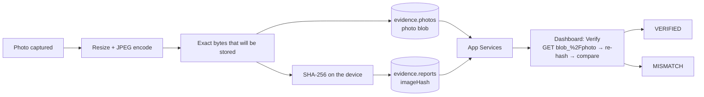

# Evidence integrity

A field report is evidence. It may end up in a dispute over who knew what, and when. FieldProof's answer is
small and old-fashioned: hash the bytes at the moment of capture, on the device, before anything syncs, and
let anyone re-check the hash later.

## How FieldProof uses it

**Hash the stored bytes, not the camera's bytes.** `PreparedPhoto` resizes and encodes the JPEG first, then
`EvidenceHash.sha256Hex` runs over exactly the bytes that will be written to the photo document. If the hash
covered the original and the app stored a re-encoded copy, verification would fail for innocent reasons and the
whole mechanism would be noise.

**The same bytes feed the AI.** `ImageAnalyzer.analyze(jpeg:hash:)` takes those bytes too, so the vector on the
report always describes the photograph the report carries.

**The hash travels on a different document from the pixels.** `imageHash` is a field on the report in
`evidence.reports`; the JPEG is a blob on a document in `evidence.photos`. Changing the picture without changing
the recorded hash is therefore the natural shape of an attack — and it is exactly what `Verify` catches.

**Verification is a re-computation, not a lookup.** `/api/verify/:id` reads the report's `imageHash`, fetches the
attachment bytes from App Services (`blob_%2Fphoto`), computes SHA-256 over what came back, and compares. The
dashboard shows `VERIFIED` or `MISMATCH` with the server's byte count and hash. The phone can do the same thing
locally on a report detail screen.

**The demo makes the attack concrete.** `scripts/tamper.mjs` acts as an insider with valid credentials:

1. `PUT` new bytes to the attachment `blob_/photo`.
2. `PUT` the document with its `photo` blob metadata pointing at the new digest, so phones pull the swapped photo too.

It prints the recorded hash, the hash before, and the hash after. Verify then reads `MISMATCH`, and the tampered
photograph even syncs down to the phone — where the recorded hash still does not match. The point lands harder
that way: the tamper succeeded in changing the picture and failed to change the truth about it.

Run it, then undo it with `npm run reset`.

## What this does and does not prove

| Claim | True? |
|---|---|
| The stored photo is byte-identical to what the device hashed at capture | Yes, if the hash is intact |
| Someone with server access changed the photo | Detected |
| Someone with server access changed the photo **and** the recorded hash | **Not** detected by this mechanism alone |
| The photograph depicts what the metadata says, at that place and time | No — GPS and time come from the device and are as trustworthy as the device |

The last two rows are the honest limits, and they are the doorway to the enhancements below. Say them out loud
in front of a security-minded customer; they will respect the answer more than a claim of tamper-proofing.

## Talking points

- "The hash is computed on the phone, at capture, over exactly the bytes we store — before anything syncs."
- "Verify does not look up a stored answer. It re-hashes what the server is holding right now."
- "Here is the attack: I have valid credentials and I swap the photo. Verify catches it in one click."
- "The tampered photo even reaches the crew's phone — and it still fails verification there."
- "What this does not prove is that the camera saw what the metadata claims. For that you want a signature from
  the Secure Enclave, and that is a small addition."

## Possible enhancements

- **Sign the hash in the Secure Enclave.** A per-device key signs `hash || timestamp || location` at capture.
  Now altering the hash requires the device's private key, which cannot be extracted. Add App Attest to prove
  the signing app is a genuine build of your app on genuine hardware.
- **Append-only ledger.** Write each capture's hash into an immutable log document (or an external timestamping
  service), so the recorded hash itself has a second copy that an insider would also have to alter.
- **C2PA content credentials** so provenance travels with the file when it leaves the system in a report or an email.
- **Hash the metadata too.** Include GPS, heading, time and author in the signed payload so the whole record is
  covered, not just the pixels.
- **Retention and legal hold** driven by status, with resolved evidence kept immutable for a statutory period.

## Alternatives and trade-offs

| Option | Trade-off |
|---|---|
| **Hash on the server at ingest** | Easy, and worthless against the threat that matters: it certifies what the server received, not what the camera saw. Everything between the device and the server is unverified. |
| **Perceptual hash (pHash)** | Answers "is this the same scene?", which is a useful but entirely different question — and that job is already done here by the vector index. A cryptographic hash is what you need for chain of custody. |
| **Digital signature on the whole document** | Stronger than a hash and the natural next step; it needs key management, rotation and a verification path, which is why it is an enhancement rather than the demo. |
| **Blockchain anchoring** | Anchoring a daily Merkle root in a public ledger is defensible. Anchoring every photograph is expensive theatre. |

Related: [on-device-ai](on-device-ai.md) · [dashboard-and-capella](dashboard-and-capella.md)
