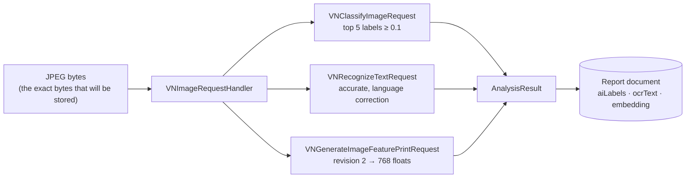

# On-device AI

Up to five models run on the phone, with the radio off: a classifier, a text recogniser and an image
embedder on every capture, plus speech recognition and a language model when the crew member asks for them. Measured on an iPhone, a full analysis takes **257–323 ms** (`docs/REFERENCE.md` §7).
Nothing is uploaded to get them.



## How FieldProof uses it

`AI/ImageAnalyzer.swift` runs all three requests against one `VNImageRequestHandler`, off the main thread, and
reports each stage back to the capture screen so the crew member sees "Classify → Read text → Fingerprint".

**The classifier** keeps the top five labels at confidence 0.1 or better. It is Apple's general-purpose taxonomy,
so a close-up of broken asphalt scores low on everything (`liquid` and `water` around 12%). That is honest and it
is in the screenshot: the labels are *supporting metadata*, and the crew member picks the category. This is worth
saying out loud rather than hiding — it is exactly the point where a customer's own trained model earns its keep.

**Text recognition** is the quiet workhorse. Asset tags, cabinet numbers, street signs and posted notices come back
as text attached to the report, searchable later, with no typing in the field.

**The feature print** is the one that matters for the demo. Revision 2 produces a **768-float** descriptor of the
image, pinned explicitly:

```swift
request.revision = VNGenerateImageFeaturePrintRequestRevision2   // pin the model so vectors stay comparable
```

Pinning the revision is the whole ballgame for a vector index. Vectors are only comparable to other vectors from
the same model, so an OS update that quietly changed the model would silently poison every stored embedding. The
model name is also stored on each report (`Embedding.model = "vision-featureprint-r2"`), so a future migration can
tell old vectors from new ones.

**Failure is not fatal.** Each request runs inside `attempt(...)`: if a model fails, it is logged and the capture
proceeds with an empty result. The evidence — photograph, GPS, time, hash — never depends on the AI succeeding.

**The simulator caveat, stated plainly.** Vision's image models do not run on the iOS simulator; they either fail
to create a compute context or return a constant vector for every image (`docs/REFERENCE.md` §7.1). FieldProof
handles this honestly instead of faking it: on the simulator, labels and vectors for the bundled samples come from
`analysis.json`, computed on the Mac by `scripts/embed-samples.swift` with the same Vision model, and the review
screen says so on screen. Text recognition does work on the simulator once the request is pinned to the CPU. On a
real iPhone all three run live, and the measured difference between the Mac-computed vector and the device's own
vector for the same bytes is 2.1e-4 — the two agree on every duplicate.

## Deferring the AI — and its bill — past the edge

This is the argument a customer with a large fleet cares about.

| | On the device (FieldProof) | In the cloud |
|---|---|---|
| Marginal cost per photo | zero | per-call inference charge, plus egress |
| Latency | 257–323 ms, local and predictable | network round trip, plus queueing and rate limits |
| Works with no signal | yes | no — capture cannot complete |
| Data leaving the device | photograph only, later, over sync | every photograph, immediately, to a third party |
| Scaling cost | flat: every new phone brings its own compute | linear in photographs |
| Failure mode | degraded metadata, evidence still captured | capture blocked or queued indefinitely |

The economics invert at the edge. A crew of two hundred taking forty photographs a day is 8,000 inferences a day
that simply do not appear on an invoice, because they run on hardware the organisation already bought and already
replaces on a cycle. The vector search sits on the same side of the line: the duplicate check is a local index
lookup, not an API call, so the *second* AI workload is free as well.

What stays in the cloud in this design is the part that is genuinely global: the system of record, cross-district
analysis, and anything that needs to see every district at once. That split — inference at the edge, aggregation
in Capella — is the architecture, not an optimisation.

## Talking points

- "Three models, about three hundred milliseconds, on a phone in a canyon. No API key, no invoice, no upload."
- "We pin the model revision, because a vector is only comparable to vectors from the same model."
- "The labels are weak on close-up asphalt, and we show that. It is the honest place to say: this is where your
  own Core ML model, trained on your photographs, goes."
- "The AI is supporting evidence. If a model fails, the report is still filed, hashed and synced."
- "Every phone you add brings its own inference capacity with it. That is not true of a cloud API."

## Two more models, added in Phase 7

**A spoken note** (`AI/VoiceNotes.swift`). `SFSpeechRecognizer` with
`request.requiresOnDeviceRecognition = true` — the one line that keeps the audio on the phone. The review
screen gets a "Dictate the note" button; partial results appear as the crew member speaks, and the text is
appended to the note when they stop. Gloves on, no typing, no signal.

> The simulator cannot do this: with both permissions granted it fails with "Failed to initialize recognizer"
> (`docs/REFERENCE.md` §7.5). Demonstrate dictation on a device. Note also that Apple's own permission alert
> says speech data "will be sent to Apple" — that is the system's generic text; `requiresOnDeviceRecognition`
> is what governs it.

**A one-line summary** (`AI/ReportSummary.swift`). Apple's Foundation Models write the report's title from
its own facts — category, labels, recognised text, the crew member's note:

```swift
let session = LanguageModelSession(instructions: instructions)
let response = try await session.respond(
    to: facts, options: GenerationOptions(temperature: 0.2, maximumResponseTokens: 40))
```

Measured on an iPhone 15 Pro Max: **4.455 s** for a sentence (`ReportSummaryTests`, run on the device). That is
slow enough to matter, so it runs in the background while the review screen is on screen, and the report is
filed with or without it. Example output, from the same prompt on macOS: *"Tree across far lane on bridge
approach."*

The simulator reports the model as available and then fails to generate, because its safety assets are not
installed, so the app says so on screen rather than pretending (§7.5). `ReportSummaryTests` skips on the
simulator and runs on a device, which makes it the quickest way to check Apple Intelligence on real hardware.

Both are guarded: the report is filed even when the model is missing, refuses, or is switched off. AI is
supporting evidence here, never a gate.

## Possible enhancements

> **Capella AI Data Plane (paid).** The phone's one-line summary needs Apple Intelligence: iOS 26 on an
> iPhone 15 Pro or newer. A report from an older phone syncs without one today. With the AI Data Plane, a SQL++
> `ai_summary` or `ai_completion` call on the server could write it from the same facts after sync. The trade is
> the one in the table above: a per-call charge, a round trip, and the data leaving the device. Capture never waits
> for it. Not part of this demo, which runs on the Capella free tier; see the review item in `docs/PLAN.md` §17.1 and `docs/REFERENCE.md` §4.

- **A custom classifier trained with Create ML** on the customer's own categories (pothole, spalling, corrosion,
  graffiti, vegetation) and dropped in as a Core ML model. This is the direct answer to the weak generic labels,
  and it is a day of work if the customer has labelled photographs.
- **Structured generation** with Foundation Models (`@Generable`) so the model fills a typed struct — severity,
  access notes, suggested trade — instead of a sentence.
- **A prompt in the crew member's language**, with the summary written in the language the supervisor reads.
- **Depth or LiDAR** on Pro devices to estimate the size of a defect rather than describing it.
- **Android parity** with ML Kit or TFLite and Couchbase Lite for Android; the document model does not change.

## Alternatives and trade-offs

| Option | Trade-off |
|---|---|
| **Cloud vision API** (Google Vision, Rekognition, GPT-4o class models) | Much richer labels and real reasoning about the scene. Costs per image, needs connectivity at capture time, sends photographs to a third party, and adds a latency floor. A hybrid is reasonable: classify on the device, enrich in the cloud later for the reports that matter. |
| **Open-source embedding models via Core ML** (DINOv2, CLIP) | Better retrieval quality and text-to-image search. Larger app bundle, a model to ship and update, and a different vector dimensionality — which means rebuilding the index and re-embedding history. |
| **Server-side embedding only** | One model version to manage, but the duplicate check stops working offline, which is the demo's first beat. |
| **No AI at all** | The crew types a category and searches by eye. Duplicate reports pile up; that is the problem this app exists to solve. |

Related: [vector-search-on-device](vector-search-on-device.md) · [evidence-integrity](evidence-integrity.md)
