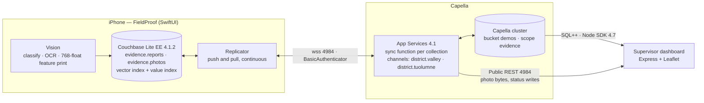
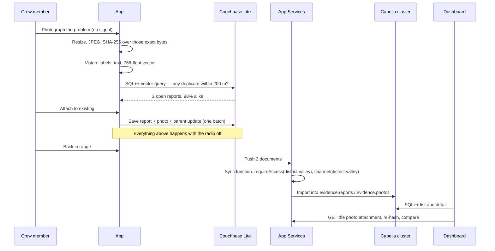

# FieldProof — architecture overview

FieldProof is an offline-first field reporting demo. A crew member photographs a problem, the phone does the
thinking (AI, hashing, duplicate search) with no network, and everything syncs to Capella when signal returns.
A supervisor dashboard reads the same data from the cluster.

Audience for this document: a Couchbase solutions engineer who will present it, and a developer who will fork it.

## The system

Two paths reach the dashboard on purpose. **SQL++ through the cluster** answers "which reports, where, what status" —
that is what a query engine is for. **App Services' Public REST API** serves the photo bytes and takes status writes,
because blobs live as attachments on the sync side and a write made there flows back down to the phones. The dashboard
signs in as the `supervisor` app user; no admin credential exists anywhere in this repo.

## Data flow: capture to dashboard

## Document model

Two collections in one scope, on the phone and in the cluster, with the same names.

| Collection | Document | Key fields |
|---|---|---|
| `evidence.reports` | `report::<uuid>` | `type`, `district`, `status`, `category`, `createdAt`, `createdBy`, `location{lat,lon,accuracy,altitude,heading}`, `aiLabels[]`, `ocrText`, `notes`, `embedding[768]`, `imageHash`, `thumbnail` (blob), `relatedReportIds[]`, `attachedTo` |
| `evidence.photos` | `photo::<uuid>` | `type`, `district`, `reportId`, `photo` (blob), `bytes`, `imageHash` |

Why two documents: the report is small and should arrive first so the map updates quickly; the full photo is
hundreds of kilobytes and follows. Both carry `district`, so one sync function per collection is enough. The thumbnail
is a small blob on the report, which is why the list and the map have pictures before the photos finish syncing.

`attachedTo` is the duplicate story: a capture that duplicates an existing report is saved and linked, never dropped.
The parent's `relatedReportIds` gets the new id in the same batch.

## The five beats, mapped to code

| Beat | Where it lives |
|---|---|
| 1. Works with no signal | `DatabaseManager.swift` opens a local database; every save is `ReportRepository.save()` in `inBatch` |
| 2. AI runs on the device | `AI/ImageAnalyzer.swift` — `VNClassifyImageRequest`, `VNRecognizeTextRequest`, `VNGenerateImageFeaturePrintRequest` |
| 3. Duplicate check before saving | `Data/DuplicateCheckQuery.swift` — one SQL++ statement, `APPROX_VECTOR_DISTANCE` plus a bounding box |
| 4. Trustworthy evidence | `AI/EvidenceHash.swift` at capture; `dashboard/server.js` `/api/verify/:id` re-hashes what the server holds |
| 5. Syncs, scoped per district | `Data/SyncManager.swift`, `appservices/sync-function-*.js`, channel grants per app user |

## What the demo proves

- The phone is not a thin client. It holds a database, an index, and three models, and it answers a
  similarity question with the radio off.
- The AI cost sits on hardware the customer already bought. No per-image inference bill, no upload of photos
  to a third party, no latency floor set by the network.
- The evidence is trustworthy because the hash was computed on the device at capture, before anything synced.
- Access control is a property of the data, not of the app: the sync function and the user's channels decide
  what each phone ever receives.

## Talking points

- "Same document, same scope and collection names, on the phone and in Capella. Nothing is translated."
- "The duplicate check is a query, not a service. That is the difference between an app that works in a canyon
  and one that does not."
- "Two documents per capture is a deliberate choice: metadata is on the map in about a second, the photo follows."
- "The supervisor dashboard uses ordinary SQL++ for the map, and App Services for the bytes and the writes."

## Possible enhancements

> **Capella AI Data Plane (paid).** FieldProof puts inference at the edge and aggregation in the cloud (`on-device-ai.md`). That leaves
> room on the cloud side. The paid AI Data Plane adds AI Functions in SQL++ (summaries, classification, PII
> masking), hosted models, vectorization workflows, and an MCP server. The component notes say where each fits. Not part of this demo, which runs on the Capella free tier; see the review item in `docs/PLAN.md` §17.1 and `docs/REFERENCE.md` §4.

- Delta sync for the report documents, and a push filter that holds full-resolution photos until Wi-Fi.
- Peer-to-peer replication between crew phones (Couchbase Lite 4.1 multipeer) so a convoy shares findings with
  no infrastructure at all.
- Capella Columnar or Eventing on the server side for trend analysis and notifications.
- OIDC sign-in instead of the demo user picker (`docs/DEFECTS.md` D2).

## Alternatives and trade-offs

| Approach | What you give up |
|---|---|
| REST API + local queue | You write and debug sync yourself: conflicts, retries, partial failures, per-user filtering. |
| Cloud-only app | Nothing works in a canyon. The demo's first beat disappears. |
| Cloud AI for the image work | Latency, per-image cost, and photos leaving the device; capture cannot complete offline. |
| One document per capture with the photo inline | Simpler model, slower first paint, and every status change re-syncs the photo. |

Component documents: [couchbase-lite](couchbase-lite.md) · [vector-search-on-device](vector-search-on-device.md) ·
[on-device-ai](on-device-ai.md) · [sync-and-app-services](sync-and-app-services.md) ·
[evidence-integrity](evidence-integrity.md) · [dashboard-and-capella](dashboard-and-capella.md)
