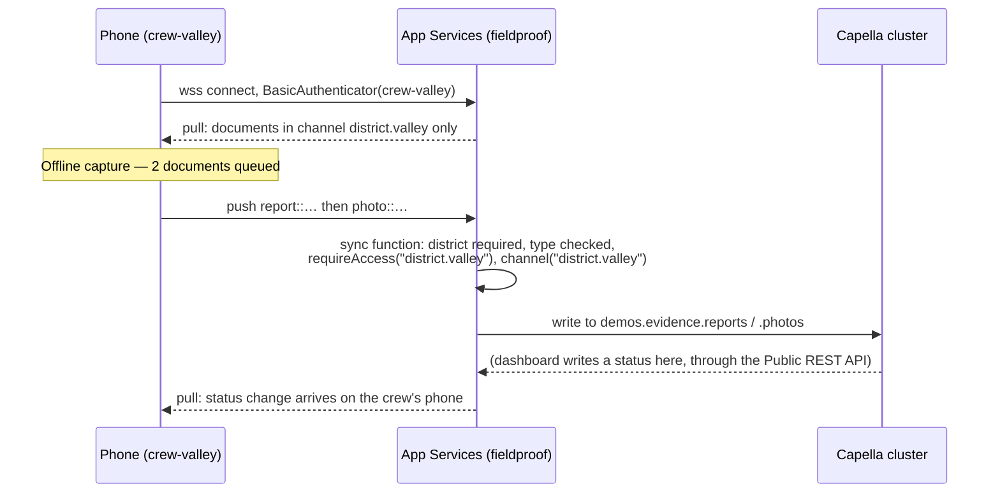

# Sync and Capella App Services

Capella App Services is the sync tier: it speaks the Couchbase Lite replication protocol to phones over a
WebSocket, runs a small JavaScript function on every write to decide access, and keeps the documents in the
Capella cluster where SQL++ can reach them.



## How FieldProof uses it

**One replicator, two collections.** `SyncManager.start(repository:user:)` builds a
`ReplicatorConfiguration(collections:target:)` with both collections, `.pushAndPull`, continuous, authenticated
as the selected app user. The app shows the replicator's own state — `OFFLINE`, `SYNCING n`, `SYNCED` — from
`replicator.addChangeListener` plus `replicator.pendingDocumentIds(collection:)` for the pending count.

**The sync function is eleven lines,** the same in both collections:

```javascript
function (doc, oldDoc, meta) {
  if (doc._deleted) { return; }                       // tombstones keep the old channel
  if (!doc.district) { throw({ forbidden: "district is required" }); }
  if (doc.type !== "report") { throw({ forbidden: "wrong type for reports collection" }); }
  if (oldDoc && oldDoc.district !== doc.district) { throw({ forbidden: "district cannot change" }); }
  var ch = "district." + doc.district;
  requireAccess(ch);   // the writing user must already have access to that district
  channel(ch);         // route the document to that district's channel
}
```

Three jobs in one place: **validation** (a district is required, the type must match the collection),
**authorisation** (`requireAccess` — you may only write into a district you already hold), and **routing**
(`channel` — this document belongs to that district and only phones granted it will ever see it).

**Channels are the access model.** `crew-valley` holds `district.valley`, `crew-tuolumne` holds
`district.tuolumne`, and the supervisor holds both. Measured after a reset: `crew-valley` pulls 25 of the 30
seeded reports, `supervisor` pulls all 30. The Tuolumne data is not filtered out in the app — it never arrives.

One sharp edge, found by testing and written up as `docs/DEFECTS.md` D1: the `*` channel lets a user **read**
everything but does not satisfy `requireAccess("district.valley")` for a **write**. The supervisor needs the
district channels listed explicitly on both collections. Grants belong on collections, not just on the database.

**Two documents, in order.** A capture writes a small report and a large photo. The `_changes` feed shows the
report at sequence 108 and its photo at 109: metadata reaches the supervisor's map first, pixels follow.

**Blobs become attachments, with a name worth knowing.** A Couchbase Lite blob in field `photo` arrives as the
attachment `blob_/photo`, and the Public REST path must URL-encode it: `GET /{keyspace}/{docid}/blob_%2Fphoto`.
The document keeps the blob metadata (`@type`, `digest`, `length`). The dashboard and `scripts/tamper.mjs` both
depend on this; the unencoded form returns 404.

**Auto-purge.** `enableAutoPurge` defaults to true: if a user loses access to a channel, the affected documents
are removed from that device. Moving a crew member between districts cleans their phone without a wipe.

**No admin credential anywhere.** The Capella Admin REST API (port 4985) covers only users, roles and sessions —
it cannot touch documents. The dashboard and the scripts therefore authenticate on the **Public** API as the
`supervisor` app user, which is also the right security posture: an app user, scoped by channels, not an
administrator.

## Talking points

- "Eleven lines of JavaScript are the entire access model, and they live with the data, not in the app."
- "A Tuolumne crew member's phone never receives Valley data. That is not a filter in the UI, it is what
  replication sends."
- "The pending count comes from the database itself. The app does not maintain its own outbox."
- "Lose access to a channel and the documents leave the device on their own."
- "Nothing here needs an admin credential. The dashboard signs in as an ordinary app user."

## Possible enhancements

- **OIDC sign-in** so identity comes from the customer's provider and district access maps from group claims,
  replacing the demo's bundled passwords (`docs/DEFECTS.md` D2).
- **Roles instead of per-user channel lists** — `district-valley`, `district-tuolumne`, `supervisor` — so adding
  a district is one change, not one per user (D1, recommended option).
- **Delta sync** so a status change ships the change, not the document.
- **Push filters** to hold full-resolution photos until the phone is on Wi-Fi, while metadata syncs on cellular.
- **XDCR between App Services clusters** for multi-region crews.
- **The `_changes` feed** (longpoll) to drive live dashboard updates instead of polling.

## Alternatives and trade-offs

| Option | Trade-off |
|---|---|
| **Self-hosted Sync Gateway** | Same protocol and the same sync functions, with the admin REST API you cannot have in Capella and full control of the deployment. You run it, patch it and scale it. |
| **Custom REST + a queue** | Total control, and you rebuild checkpoints, conflict resolution, attachment handling, resumable transfer and per-user filtering — badly, at first. |
| **Per-document ACLs in the app** | Filtering in the UI is not security: the data is already on the device. Channels decide before the bytes leave the server. |
| **One collection for everything** | Fewer moving parts, but the photo and the report then sync together, and the map waits for the pixels. |

Related: [couchbase-lite](couchbase-lite.md) · [dashboard-and-capella](dashboard-and-capella.md) · [evidence-integrity](evidence-integrity.md)
