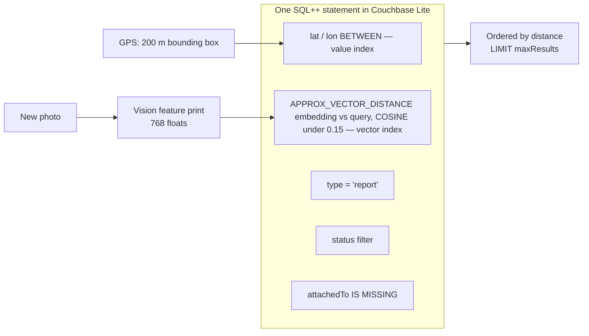

# Vector search on the device

The headline moment of the demo: a phone with no network decides that the photo just taken is the same
problem someone already reported — an index lookup in the embedded database, with nothing to call.

## The shape of the query



## How FieldProof uses it

**The index.** Created once at startup in `DatabaseManager.createIndexes`:

```swift
var vector = VectorIndexConfiguration(expression: "embedding", dimensions: 768, centroids: 8)
vector.metric = .cosine
vector.encoding = .none
try reports.createIndex(withName: "idx_reports_embedding", config: vector)
```

- **768 dimensions** because that is what Vision's feature print revision 2 produces.
- **8 centroids.** The index partitions vectors into buckets and searches the nearest ones. The usual starting
  point is around the square root of the expected row count; at 30–100 reports per phone, 8 is right. Raise it
  as the corpus grows.
- **Cosine**, because feature prints are compared by direction, not magnitude, and the app normalises anyway.
- **No encoding.** Scalar or product quantisation trades accuracy for memory. At this size there is nothing to save.

**The query** lives in `ios/FieldProof/Data/DuplicateCheckQuery.swift`, which is meant to be shown on screen:

```sql
SELECT META().id AS id, category, status, createdAt, notes,
       location.lat AS lat, location.lon AS lon,
       APPROX_VECTOR_DISTANCE(embedding, $queryVector, 'COSINE') AS distance
FROM evidence.reports
WHERE type = 'report'
  AND (status != 'resolved' OR $includeResolved)
  AND attachedTo IS MISSING
  AND location.lat BETWEEN $minLat AND $maxLat
  AND location.lon BETWEEN $minLon AND $maxLon
  AND META().id != $excludeId
  AND APPROX_VECTOR_DISTANCE(embedding, $queryVector, 'COSINE') < $maxDistance
ORDER BY APPROX_VECTOR_DISTANCE(embedding, $queryVector, 'COSINE')
LIMIT $maxResults
```

Two things to point out while it is on screen. First, the metric argument `'COSINE'` is **required** in 4.1.2 and
must match the index, or the query fails. Second, everything else in that `WHERE` clause is ordinary SQL++ over
ordinary fields — a status filter, a geographic box, an exclusion — evaluated in the same statement as the vector
distance. That is the pattern: **cheap predicates narrow the candidates, the vector index ranks what is left.**

**The box before the vectors.** 200 m of latitude and longitude around the capture, computed in `GeoBox.swift`.
Two potholes that look identical but are in different districts are not duplicates; a bounding box says so for
the cost of an index range scan. "Find similar" on a report detail reuses the same query with a 2 km radius and
resolved work included.

**The threshold, measured rather than guessed.** Settings → Developer records the raw distances of the last check,
which is how 0.15 was chosen (`docs/REFERENCE.md` §7.2):

| Pair | Cosine distance |
|---|---|
| Same pothole, crop and hue shift | 0.019–0.020 |
| Same pothole, 3° rotation, +8% brightness | 0.092–0.102 |
| Closest different subjects in one category | 0.124 |
| **Threshold** | **0.15** |
| Different potholes | 0.18–0.31 |
| Different category entirely | 0.23 and up |

The plan started at 0.35, which matched any two potholes. The data moved it. That gap — 0.10 to 0.15 — is also
why the simulator and a real device agree: the worst difference between a Mac-computed vector and the same bytes
embedded live on an iPhone 15 Pro Max was 2.1e-4.

## Talking points

- "Vector search runs inside the embedded database. No service to call, no round trip, nothing to pay per query."
- "One statement mixes a vector distance with a status filter and a geographic box. You do not need a separate
  vector store and a separate database and then code to join them."
- "The threshold is a number you measure on your own photographs, not a constant you copy from a blog."
- "Thirty reports on a phone today, thirty thousand in the cluster tomorrow — the index is the same idea in both places."

## Possible enhancements

- **Server-side vector search** with the Capella Search service for cross-district deduplication, where the
  question is bigger than one phone's data.
- **Capella AI Services** to vectorize images that arrive from other channels (email, a web portal, a contractor's
  upload) with the same model family, so the corpora are comparable.
- **Text embeddings for notes**, combined with full-text search, to catch "same pothole, described twice" when the
  photographs are taken from opposite sides.
- **A CLIP-style model via Core ML** for text-to-image search ("show me broken handrails"), at the cost of a larger
  app bundle and a different vector dimensionality — changing dimensions means rebuilding the index.
- **Lazy vector index** if embeddings are computed after the document is saved.

## Alternatives and trade-offs

| Option | Trade-off |
|---|---|
| **Brute-force cosine in Swift** | Perfectly fine below a few thousand vectors, and easy to explain. You lose the `WHERE` clause: you must load candidate rows and filter them yourself, and the cost grows linearly with every report on the device. |
| **sqlite-vec or a similar extension** | Adds a vector index to SQLite, but you are back to writing your own sync, and the vector and document worlds stay separate. |
| **Cloud vector database** (Pinecone, pgvector, Atlas Vector Search) | Better recall at very large scale, and the right answer for a corpus of millions. It needs connectivity, which is exactly what the first beat of this demo does not have. |
| **Compare hashes instead of vectors** | Perceptual hashes catch near-identical files, not the same pothole photographed from two metres left on a different day. |

Related: [on-device-ai](on-device-ai.md) · [couchbase-lite](couchbase-lite.md)
