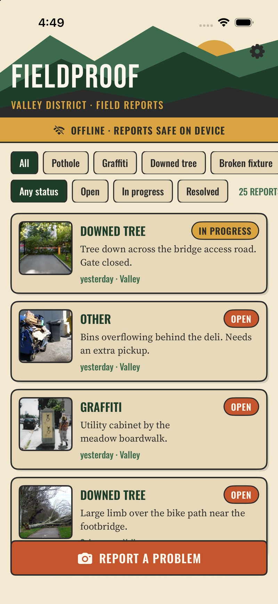
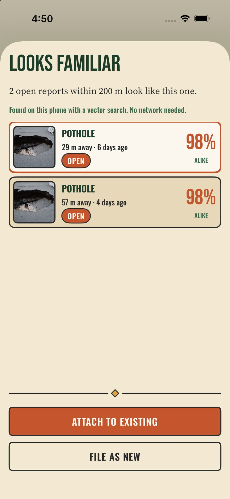
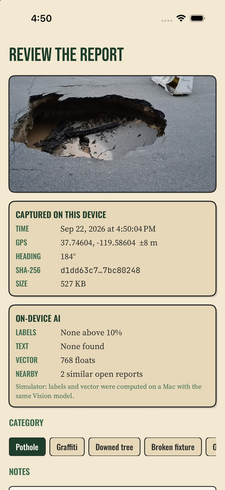
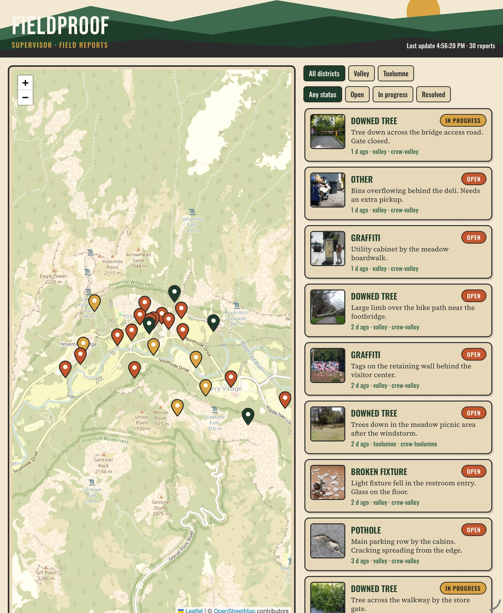
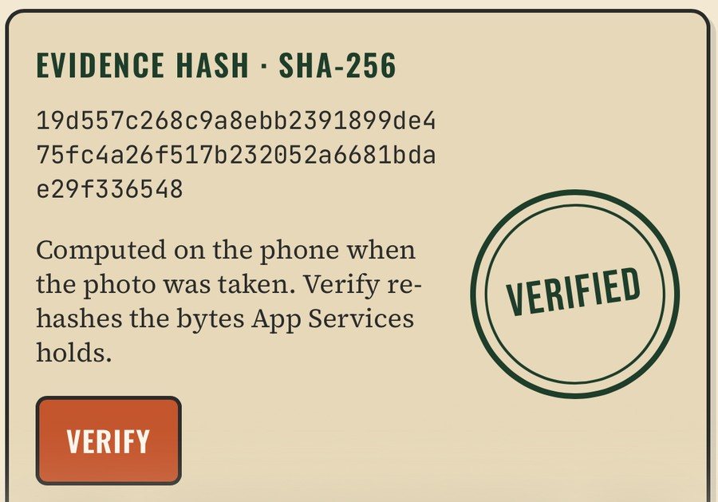
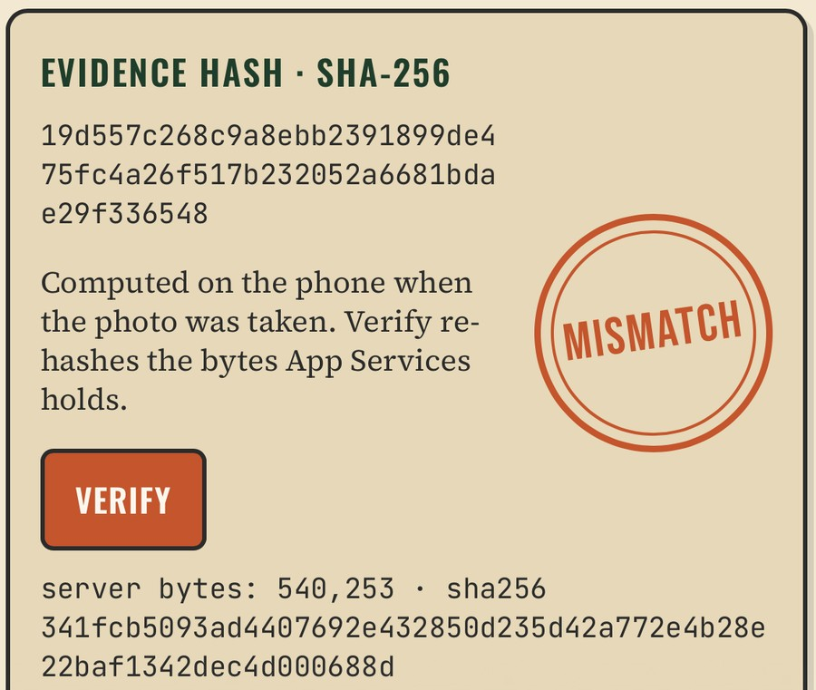

# FieldProof demo guide

Five minutes, one phone, one laptop. This is the presenter's copy: what to click, what to say, and what to do
when something goes wrong. It was rehearsed end to end on the simulator three times from a reset state.

The README has the setup; this document assumes it is done.

---

## Fifteen minutes before

1. **Resume Capella.** The free tier pauses the cluster and the App Endpoint after 72 idle hours. Resume both and
   wait a minute. Open the dashboard and confirm it loads.
2. **Reset and seed.** From `dashboard/`: `npm run reset`, then in the app Settings → Demo → **Load sample reports**.
   Seeding takes 13–19 seconds and must be online. Confirm 30 pins on the map.
3. **Switch back to `crew-valley`.** Seeding uploads as `supervisor`; the app hands the phone back automatically,
   but check the header says VALLEY DISTRICT and the list shows 25 reports. That difference — 25 on the phone,
   30 on the map — *is* the channel story; have it on screen.
4. **Turn Simulate offline off** so the banner starts green.
5. **Open a terminal** in `dashboard/` for the tamper step, and have a report id copied (the dashboard detail page
   shows it in the ID row).
6. **Mirror the phone** and have the dashboard on the laptop, side by side if you can.

---

## The five minutes

| Time | Do | Say |
|---|---|---|
| **0:00** | Dashboard: the map, 30 pins coloured by status. | "Every one of these came from a phone that was offline when the report was taken. Swap the park for a utility territory, a campus, or a highway district — the app does not change." |
| **0:30** | Phone: Settings → **Simulate offline** on. Banner turns amber: OFFLINE. Close Settings. | "This phone now has no network at all. Watch what still works." |
| **0:45** | **Report a problem** → pick `capture-pothole`. Watch Classify → Read text → Fingerprint. | "Three of Apple's models just ran on the phone: a label, any text in the photo, and a 768-number fingerprint of the image. No upload, no API key, no per-image charge." |
| **1:15** | The review screen: time, GPS, heading, SHA-256, what the AI found. | "The hash is computed here, at capture, over exactly the bytes we store — before anything syncs." |
| **1:30** | **Looks familiar**: 2 open reports within 200 m, 98% alike, 29 m and 57 m away. Put `DuplicateCheckQuery.swift` on screen for 20 seconds. | "That is one SQL++ query running inside the database on the phone: a vector distance, a 200-metre box, and a status filter, in the same statement. No network, no service to call." |
| **2:30** | **Attach to existing**. Open the parent report; tap **Find similar**. | "The evidence is never dropped — the new photo is filed against the report it duplicates. Same query, wider radius, resolved work included." |
| **3:15** | Settings → Simulate offline **off**. Point at the pending count *before* you flip it. | "Two documents were waiting: the new capture and the updated original." (On a good connection SYNCING flashes past in under a second — the count before the switch is the part to point at.) |
| **3:30** | Dashboard: the report now shows "+1 attached capture". | "Channels sent it to this district only. A Tuolumne crew never sees Valley data — not filtered in the app, never delivered." |
| **4:00** | Dashboard → **Verify** → VERIFIED. Then in the terminal: `npm run tamper -- <report id>`. Reload, **Verify** again → MISMATCH. | "Now I am an insider with valid credentials and I swap the photograph. One click, and the hash the phone computed at capture no longer matches what the server is holding." |
| **4:30** | Dashboard: set the report to **In progress**. Watch the phone's list update by itself. | "The supervisor's change is an ordinary document write through App Services, so it syncs straight back down to the crew." |
| **4:45** | Close. | "Same code path from 30 reports to 30,000: Couchbase Lite indexes the vectors on the device, App Services scopes the data, Capella holds the system of record." |

---

## What it looks like

| | |
|---|---|
|  |  |
| The banner is pinned above the list, so the audience can always see the phone's state. | The headline moment: found on this phone, with a vector search, no network. |
|  |  |
| GPS, heading, time, SHA-256 and what the models found, before the report is filed. | Every pin came from a phone that was offline at the time. |
|  |  |
| Verify re-hashes the bytes App Services is holding. | After `npm run tamper`: the photo changed, the recorded hash did not. |

A 30-second clip of the offline capture through to the duplicate check is in
[`images/video/capture-flow.mp4`](images/video/capture-flow.mp4) (simulator, sped up 3×).

---

## Three optional beats (Phase 7)

Use them when the audience asks "what else can the phone do?" — not inside the five minutes.

| Beat | Where | What to say | Watch out |
|---|---|---|---|
| **Dictate the note** | Review screen, under NOTES | "Gloves on, no signal. `requiresOnDeviceRecognition` keeps the audio on the phone." | **Device only.** The simulator answers "Failed to initialize recognizer". Apple's permission alert claims speech is sent to Apple — that is the system's generic text, not what this request does. |
| **The one-line summary** | Review screen, ON-DEVICE AI → SUMMARY | "Apple's language model wrote that sentence from the report's own facts, on the phone." | **Device only**, and about 4.5 s, so it appears while you are talking. On the simulator the card says so plainly. |
| **The dashboard updates itself** | Dashboard, while you file a report | "No polling. The server is holding a longpoll on the App Services changes feed." | Measured at about 3 seconds from filing to the pin appearing. |

---

## When it goes wrong

| Symptom | What happened | Recovery, on stage |
|---|---|---|
| Banner stays OFFLINE, Settings shows `replicator: offline` | Capella paused, or no network | Keep going — this is an offline-first demo. Do the whole capture and duplicate story, then say "and when it comes back, it syncs" and resume the cluster during questions. |
| Dashboard: "Cannot reach Capella" | Cluster paused, or your IP is not on the allowed list | Restart the dashboard after resuming the cluster — the server caches its connection and will not retry on its own (`docs/DEFECTS.md` D5). |
| Seeding says "Turn off Simulate offline first" | Samples upload as `supervisor` | Turn it off, seed, turn it back on. This is a setup step; never do it in the five minutes. |
| Duplicate check finds nothing | On the simulator, the photo is not one of the bundled samples | Use `capture-pothole`. Precomputed vectors only exist for the bundled samples; a device runs everything live. |
| Labels say "None above 10%" | True, and worth owning | "Apple's general classifier has no pavement vocabulary. That is exactly where your own Core ML model, trained on your photographs, goes. Notice the fingerprint still works — that is what the duplicate check uses." |
| The photo has not synced when you hit Verify | Reports arrive before photos by design | Wait a few seconds and press Verify again, and say why: "metadata first, pixels second — the map does not wait for the photograph." |
| Tapping a control does nothing | A sheet scrolled since you last looked | Look before you tap. This is the most common failure in rehearsal, and it is the presenter, not the app. |
| Phone list does not update after a status change | Rare; the change listener normally lands in a few seconds | Pull the list, or open and close the report. |
| Dashboard stops updating by itself | The event stream dropped | It refetches every 15 seconds regardless, so the demo continues; reload the page to reconnect. |

---

## The questions you will get

- **"Does this work on Android?"** Couchbase Lite has an Android SDK with the same model; the AI layer would be
  ML Kit or TFLite instead of Vision. The documents and sync do not change.
- **"How big can the on-device index get?"** Tens of thousands of vectors is comfortable. Raise the centroid
  count as the corpus grows, and add quantisation if memory matters. Past that, the cross-district question
  belongs on the server.
- **"What does the AI cost?"** Nothing per image. It runs on hardware the customer already owns. See
  [architecture/on-device-ai.md](architecture/on-device-ai.md) for the comparison.
- **"How do people actually log in?"** Not like this. The demo picks a user; production uses OIDC through the
  customer's identity provider (`docs/DEFECTS.md` D2).
- **"Can it detect the defect type properly?"** Not with Apple's generic classifier. With a Create ML model
  trained on a few thousand of the customer's own photographs, yes.
- **"What if two crews edit the same report?"** Couchbase Lite 4.x uses version vectors; last-writer-wins by
  default, with a custom conflict resolver available. Status changes come from the dashboard only in this demo.

---

## Reset between runs

```bash
npm run reset
```

Deletes every report and photo; the phones follow within seconds. Then seed again. Leave the cluster empty after
the last demo of the day so the next one starts from a known state.
